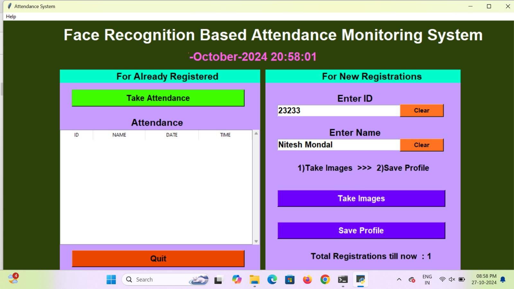
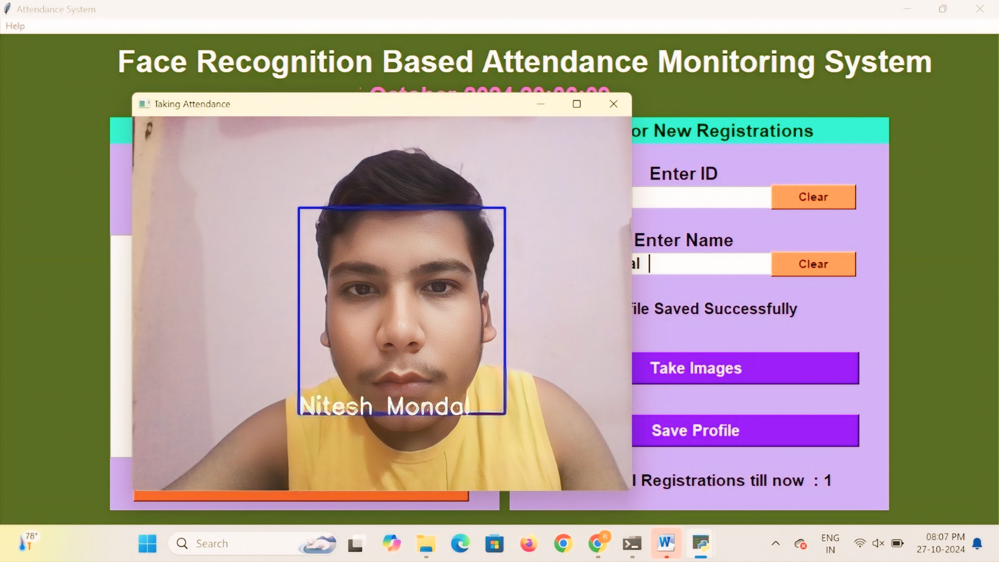

# Face_recognition_based_attendance_system
A python GUI integrated attendance system using face recognition to take attendance.

In this python project, I have made an attendance system which takes attendance by using face recognition technique. I have also intergrated it with GUI (Graphical user interface) so it can be easy to use by anyone. GUI for this project is also made on python using tkinter.

FACE RECOGNITION BASED ATTENDENCE
MONITORING SYSTEM

A face recognition-based attendance monitoring system is a cutting-edge technology that transforms the way attendance is recorded in various settings, such as educational institutions, corporate offices, and event venues. This system employs biometric facial recognition algorithms to automate the process of tracking individuals' presence, enhancing both accuracy and efficiency.

At its core, the system works by capturing a person's facial image through a camera when they enter a designated area, such as a classroom or office entrance. The software then analyzes the unique features of the face, including the distance between the eyes, nose shape, and jawline, and compares this data against a pre-registered database of enrolled users. If a match is found, the individual's attendance is automatically recorded, often in real time.

One of the key benefits of a face recognition attendance system is its ability to significantly reduce the time and effort associated with traditional attendance methods, such as manual roll calls or sign-in sheets. These conventional methods are not only time-consuming but can also be prone to human error, such as misidentification or forgetfulness. In contrast, a biometric system ensures accuracy and speed, allowing organizations to focus on their core activities rather than administrative tasks.

Security is another major advantage. By eliminating the possibility of proxy attendance where someone signs in for another individual the system enhances accountability. This is particularly important in educational settings, where attendance can impact grading and academic integrity. Furthermore, the data collected can be easily analyzed to track attendance trends over time, helping administrators identify patterns and address issues such as chronic absenteeism.

However, the implementation of face recognition technology raises important ethical and privacy concerns. Organizations must navigate the complexities of data protection regulations, such as GDPR in Europe or CCPA in California. It's vital to obtain informed consent from users before collecting biometric data and to ensure that the data is stored securely, with access limited to authorized personnel only.

Transparency about how the data will be used, as well as the measures in place to protect it, is essential to building trust among users. In conclusion, a face recognition-based attendance monitoring system offers numerous advantages, including efficiency, accuracy, and enhanced security. While the potential for misuse exists, with careful implementation and adherence to ethical standards, this technology can revolutionize attendance tracking across various sectors, providing a modern solution to a long standing challenge.

In a face recognition-based attendance monitoring system, SQL is used to manage and query the database that stores user information and attendance records. When a face is recognized, the system queries the SQL database to retrieve the corresponding user profile, updating attendance logs in real time. SQL commands facilitate data insertion, updating, and retrieval, allowing for efficient management of biometric data and attendance history. This ensures that all interactions with the database are streamlined and secure, enhancing overall system performance.

In a face recognition-based attendance monitoring system, CSV files serve as a convenient way to manage and store data. They can be used to maintain lists of enrolled users, including their names, IDs, and facial data references. When the system captures attendance, it can export records into a CSV format for easy sharing and analysis.

CSV files also allow for simple data manipulation and integration with other tools, such as spreadsheets for reporting. Additionally, they facilitate bulk uploads of user information

during initial setup, streamlining the onboarding process. Overall, using CSV files enhances data accessibility and organization in the system. Artificial Intelligence (Al) plays a crucial role in enhancing the effectiveness of face recognitionbased attendance monitoring systems. Here are some key applications of Al in this context:

Al utilizes deep learning models to accurately identify and verify individuals by analyzing facial features. These algorithms improve recognition accuracy, even under varying lighting conditions or angles.

Real-time Processing: Al enables real-time facial recognition, allowing the system to quickly identify users as they enter a venue. This instant processing helps streamline attendance recording and reduces wait times.

Anomaly Detection: Al can identify unusual patterns, such as repeated attendance by the same individual or mismatched identities, enhancing security and integrity in attendance records.

Data Analysis: Al can analyze attendance data to identify trends and patterns, helping administrators understand absenteeism, peak attendance times, and user engagement, leading to informed decision-making.

Continuous Learning: Al systems can improve over time by learning from new data. This capability allows the system to adapt to changes in users' appearances, such as aging or changes in hairstyle.

Incorporating Al into face recognition attendance systems significantly boosts their efficiency, accuracy, and reliability, transforming traditional attendance methods into modern, intelligent solutions.

 

TECHNOLOGY USED:
1) tkinter for whole GUI
2) OpenCV for taking images and face recognition (cv2.face.LBPHFaceRecognizer_create())
3) CSV, Numpy, Pandas, datetime etc. for other purposes.

FEATURES:
1) Easy to use with interactive GUI support.
2) Password protection for new person registration.
3) Creates/Updates CSV file for deatils of students on registration.
4) Creates a new CSV file everyday for attendance and marks attendance with proper date and time.
5) Displays live attendance updates for the day on the main screen in tabular format with Id, name, date and time.

# SCREENSHOTS
MAIN SCREEN:

TAKING ATTENDANCE:

